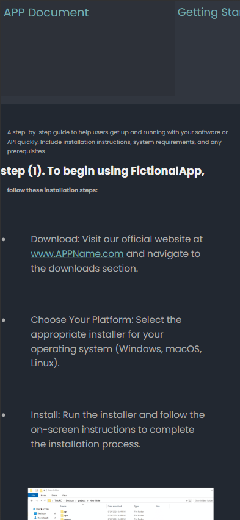
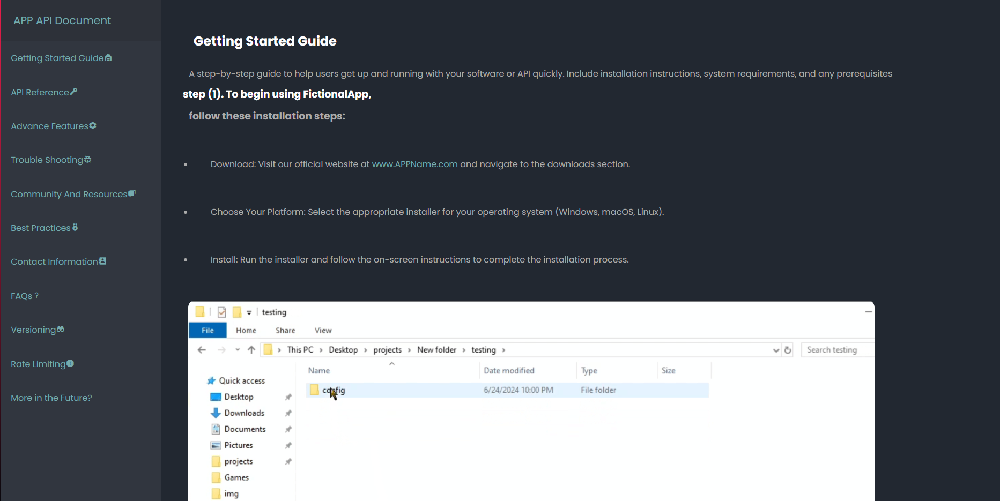

# full responsive document web-page design💻

this is a responsive app document page for mobile📱, tablet, and desktop💻

nav bar menu with smooth scroll animations
 

built with

<ul>
  <li>HTML</li>
  <li>CSS</li>
</ul>
<h3>Recently Added</h3>
<ul>
  <li>reactive icons🔴</li>
  <li>more pages📰</li>
  <li>contact section📞</li>
</ul>

<h2>More will be added soon</h2>
<ul>
  <li>Scroll animations</li>
  <li>More pages and elements</li>
  <li>Theme selector</li>
  <li>more custom information elements</li>
</ul>
<h2>Main Contributor</h2>
<h3>SirRango/Whosdouble</h3>

<h2>other contributors</h2>
<h3></h3>

